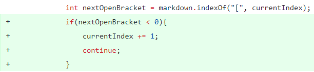
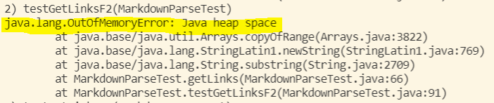
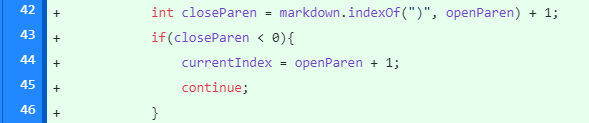
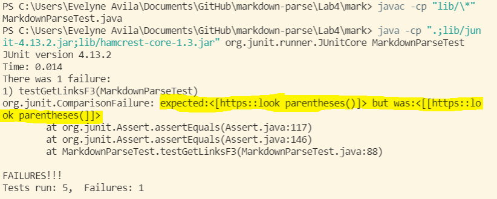
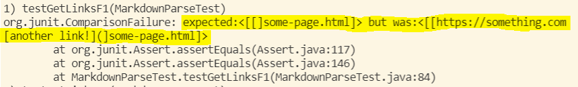

# Week 4 Lab Report 2

*Note: The testing was done through JUnit testing*

## Code change one in `MarkdownParse.java`

[See test file](https://github.com/EvelyneAvila/markdown-parse/blob/main/testfile3.md) for *failure- inducing input*

The symptom of the *failure-inducing input* is shown below:

In our failure-inducing input file we wanted to test whether the program would correctly work if it did not have the first open braket. The code that we had at first produced the symptom shown in the image above where it crashed by not having the open braket. The bug was that if it did not had any of the necesary "" characters because it would crash the program by calling markdown.indexOf looking for a character starting from index -1, which is not possible.

## Code change two in `MarkdownParseTest.java`

[See test file](https://github.com/EvelyneAvila/markdown-parse/blob/main/tes-file-4.md) for *failure-inducing input*

The symptom of the *failure-inducing input* is shown below:

When looking at the code we had, we want to introduce failure inducing input to test the *correctness* of the program. In order to do this, we introduced a file where we included extra parenthesis where the intended result was to get everything between the first "(" and the last ")". This did not occur which was the bug that we had found that the program has. The symptom was shown in this test case in the image above where the output expected included "()" and we did not obtain that so we had to change the code in `MarkdownParseTest.java` in line 42 in order to include this test case.

## Code change three in `MarkdownParse.java`

[See test file](https://github.com/EvelyneAvila/markdown-parse/blob/main/testsFile.md) for *failure-inducing input*

The symptom of the *failure-inducing input* is shown below:

When running the failure-induced input file, we saw the bug that if there was multiple links and any of them was missing any of the necessary characters (i.e. "") that it would take up to the next line until finding the missing character. This was shown in the symptom in our program output where the first link did not had ")" which led for the program into looking into the second line until finding ")" which then included everything in between. 