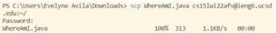

# Week 2 Lab Report 1

*Note before starting: Always speak up when having trouble or doubts regarding any step! The tutors are here to help you!*

## Installing VScode 
- Go to the [Visual Studio Code](https://code.visualstudio.com/) website. 
- Click download for your respective platform (i.e. Windows, macOS, or Linux). Follow the instructions to install it in your compute. (If you currently only have access to a tablet or Chromebook, you won't be able to install it right now)
- Once it's done installing, open up VScode and you will see something like this 

    


## Remotely Connecting
We will now continue to use VScode to connect to a remote computer over the Internet.

__*First steps for Windows only*__ 

You will need to install and configure the program *OpenSSH* to connect your computer to another computer. 
- Open settings, select Apps > Apps & Features, then click on Optional Features. Look to see if OpenSSH Client and OpenSSH Server are installed. If not, click install.
- Now, open PowerShell as an administrator, and run the following commands in order:

```
Start-Service sshd

Set-Service -Name sshd -StartupType 'Automatic'
 
if (!(Get-NetFirewallRule -Name "OpenSSH-Server-In-TCP" -ErrorAction SilentlyContinue | Select-Object Name, Enabled)) {
    Write-Output "Firewall Rule 'OpenSSH-Server-In-TCP' does not exist, creating it..."
    New-NetFirewallRule -Name 'OpenSSH-Server-In-TCP' -DisplayName 'OpenSSH Server (sshd)' -Enabled True -Direction Inbound -Protocol TCP -Action Allow -LocalPort 22
} else {
    Write-Output "Firewall rule 'OpenSSH-Server-In-TCP' has been created and exists."
}
```

__*Steps for all platforms*__

- Look up your [course-specific account for CSE15L](https://sdacs.ucsd.edu/~icc/index.php). You will need to create a new password in order to activate your account for this course. After creating the password, wait around 20 min. before proceding to the next step.
- Open VSCode and open a terminal (Ctrl or Command + , or use the Terminal → New Terminal menu option). Run the command `ssh cs15lwi22abc@ieng6.ucsd.edu` where abc are going to be specific to your account. You will most likely get a message saying:

```
⤇ ssh cs15lwi22abc@ieng6.ucsd.edu
The authenticity of host 'ieng6.ucsd.edu (128.54.70.227)' can't be established.
RSA key fingerprint is SHA256:ksruYwhnYH+sySHnHAtLUHngrPEyZTDl/1x99wUQcec.
Are you sure you want to continue connecting (yes/no/[fingerprint])? 
```

- Type `yes` to this message and give your password (on screen it will not show the typing of your password for security purposes, but it is being recognized). You should *only* say yes when connecting to a new server for the first time. You should now see a message similar to:

    

## Trying Some Commands
- Try the following commands in the VSCode terminal first in the remote computer (as we already ssh in previous step), and then on your own computer:

    `cd ~`

    `cd`

    `ls -lat`

    `ls -a`

    `ls <directory>` where `<directory>` here is `/home/linux/ieng6/cs15lwi22/cs15lwi22abc`, where the abc is your username

    `cp /home/linux/ieng6/cs15lwi22/public/hello.txt ~/`

    `cat /home/linux/ieng6/cs15lwi22/public/hello.txt`

*Note: To log out of the remote server in the terminal you can use Ctrl-D or run the command `exit`*

- It should look something like:
    

## Moving Files with `scp`
We will now see a key step in working remotely - copying files between computers
- From your own computer (i.e. not logged into ieng6) create a file called `WhereAmI.java` where the content will be:

```
class WhereAmI {
    public static void main(String[] args) {
        System.out.println(System.getProperty("os.name"));
        System.out.println(System.getProperty("user.name"));
        System.out.println(System.getProperty("user.home"));
        System.out.println(System.getProperty("user.dir"));
    }
}
```

- [If you have Java installed] Compile the file using `javac` and run it with `java` 
- In the terminal run: `scp WhereAmI.java cs15lwi22abc@ieng6.ucsd.edu:~/` where abc is your specific account and you will see something similar to:

    

    *Note: We will always run the `scp` command from the client, which is your computer not logged into `ieng6`*
- Now, log into ieng6 using ssh command. Once logged in, use `ls` and should see something like this:

    
- Now, compile and run the file using both `javac` and `java` on the ieng6 computer

## Setting an SSH Key
When wanting to use `scp`, it's going to ask us for the password everytime, and that can be a tiring repetitive task! Our solution to this problem will be `ssh` keys, using the program `ssh-keygen`. 
- Run the following on the client (your computer) to set up:

```
ssh-keygen -t ed25519
Generating public/private ed25519 key pair.
Enter file in which to save the key (C:\Users\username\.ssh\id_ed25519):
```

- Here you will just hit enter for the default space, or you can specify a path. 
- It will then ask you for a passphrase. You can just hit enter or create your own passphrase. You will do this again when asked to enter the same passphrase. It will then look something like this:

    

__*Extra step for Windows only*__
- run the command `Get-Service ssh-agent | Set-Service -StartupType Manual` in your terminal. If it gives you an error, in your computer open Services, and look for the program OpenSSH Authentification Agent. click on the name and change the Startup type from Disabled to Manual. Then try runnig the same command again.

    
- Now, run the following commands one by one:

```
Start-Service ssh-agent

Get-Service ssh-agent

ssh-add ~\.ssh\id_ed25519
```

- On the server, run command `mkdir .ssh` and then log out of the server
- Now in the client, run the command `scp 'C:\Users\Evelyne Avila\.ssh\id_rsa.pub' cs15lwi22@ieng6.ucsd.edu:~/.ssh/authorized_keys` . Enter your password. (remember: for macOS and Linux you use /, and for Windows you use \)
- Run the command `ssh cs15lwi22abc@ieng6.ucsd.edu` where abc is specific to your account. It should automatically loged you in without asking for the password. It should look somthing like this:

    

## Optimizing Remote Running
When locally editing a file, such as WhereAmI.java, it would be useful to learn a nice way to copy the edits into the remote server and run it
- run the command `ssh cs15lwi22abc@ieng6.ucsd.edu "ls"` where abc is specific to your account. This will run the command directly on the server and then exit. I would something like this:
    
- Another way is using semicolons to run multiple commands on the same line. Run the command `cp WhereAmI.java OtherMain.java; javac OtherMain.java; java WhereAmI`
