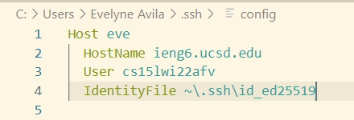
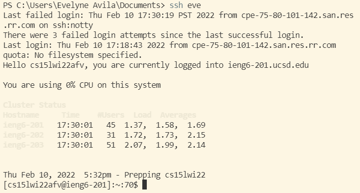
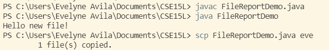

# Lab Report 3 Week 6

When we connect our *own* laptop to the server `ieng6`, we have to type (or use up and down arrows):

`$ ssh cs15lwi22abc@ieng6.ucsd.edu` 

where `abc` is specific to your course-specific account.

This can be bery tiring! So we will learn a way to make it much easier and cooler!

## Streamlining ssh Configuration

**Step 1:** In our *own* computer we will type this command `~/.ssh/config` into our terminal, which tells SSH the username to use when loggin in into this server.

It's going to ask you on which program to open this file with. In this report we chose the deafult option - VSCode.

*Note: If the file doesn't exists create the file with the contents shwon below* 

You should see the contents of this file like:

```
Host ieng6
    HostName ieng6.ucsd.edu
    User cs15lwi22abc
```

where `abc` if for your specific account.

Now that we have our `~/.ssh/config` file, we can now edit this file. We can change `ieng6` next to `Host` to anything we want. This will be the server nickname. 

**Step 2:** Let's now try the command `ssh nickname` in our terminal, where `nickname` is the nickname you chose.

If this works, then it means things are set up correctly and you successfully looged in into your ieng6 account. 
However, if there was an error message, don't worry we will do the following: 
* We will add a specific line to our `~/.ssh/config` file to explicitily refer to your `id_rsa` file which contains the private key for SSH
    * IdentityFile ~/.ssh/id_rsa_ucsd
    *Note : On Windows, instead of `/` we use `\`
* Save and try the command `ssh nickname` once again. If it fails, it means the path of the file is incorrect
    * For this, look for your `id_rsa` file mannually
        *Go into your C:\Users\[your computer username]\.ssh
        * Here you will see how the file of your private key is called, and where it might be located. An example of this is:
        
* Once again, save `~/.ssh/config` file and try the `ssh nickname` in your terminal. You should now see something like this being your new faster login:



**Step 3:** Now you will use `scp` command to copy a file to your account using the nickname you chose!

1. Choose an existent file you want to copy, or you can create your own file. For the purpose of this demonstration, a FileReportDemo.java file was created.

2. Make sure to run `javac` and `java` in your own computer if you want to copy a .java file (or created it)

3. In your *own* computer, write the following command `scp FileReportDemo.java nickname` where `nickname` is your nickname you chose in your `~/.ssh/config` file. You should see something like this:
