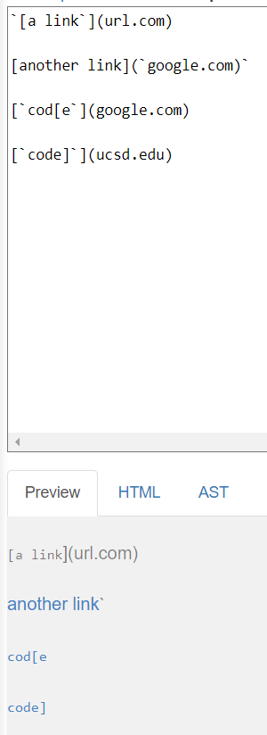
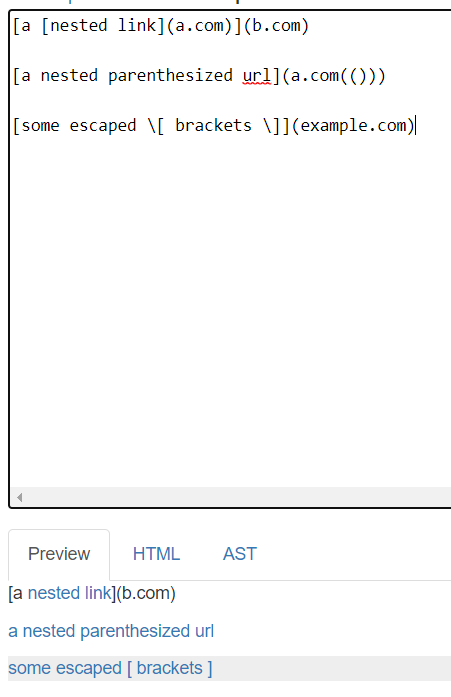
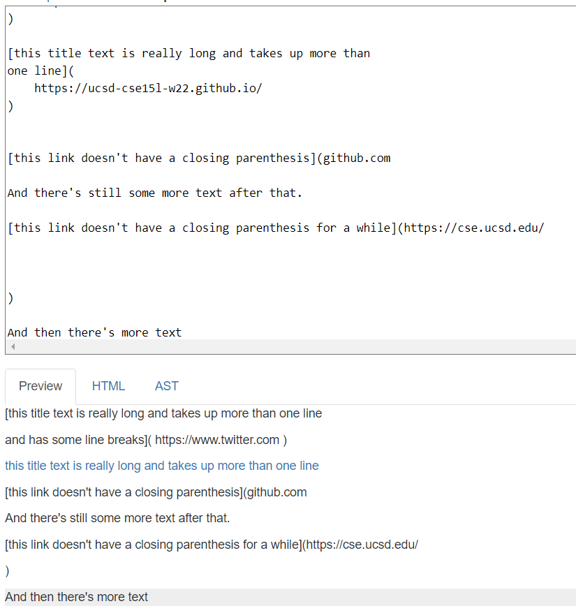
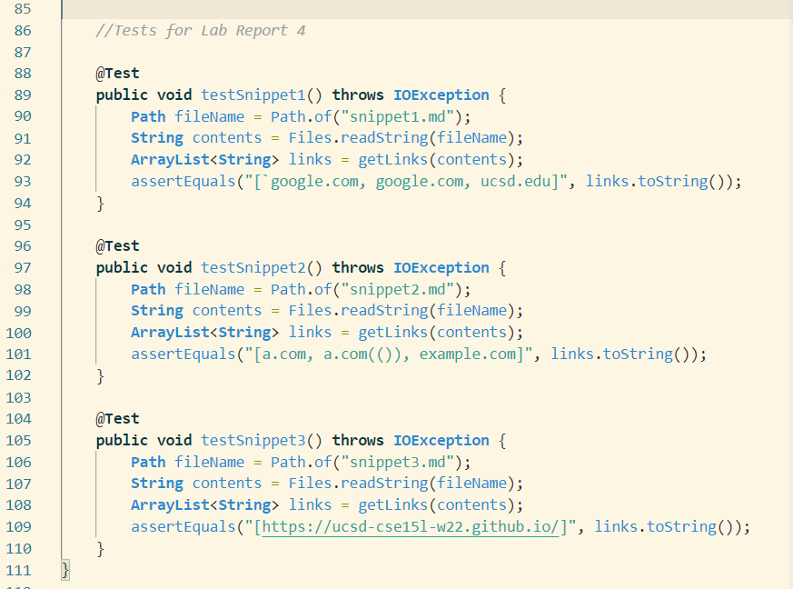
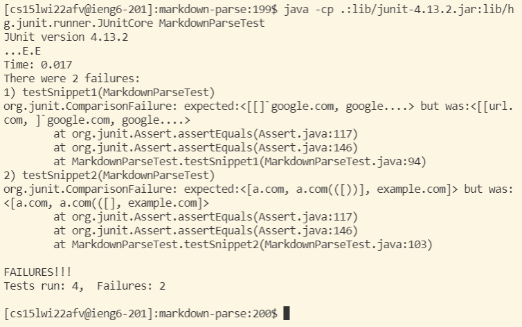
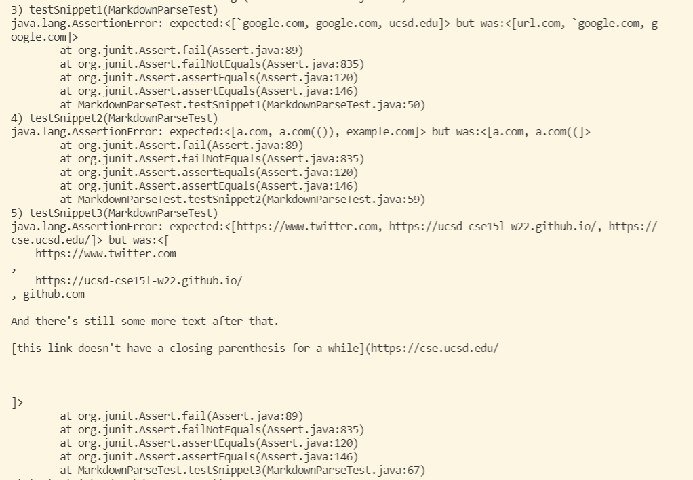

# Lab Report 4 Week 8

When creating and implementing tests, we want to have a definition for what success looks like, regardless of how our code is working. This definition is given to us by the [CommonMark demo site](https://spec.commonmark.org/dingus/) where we're going to see how our program *should* behave (in both implementations).

**What test for Snippet 1 *should* produce**

**What test for Snippet 2 *should* produce**

**What test for Snippet 3 *should* produce**

Since we have the same goal and definition of what success is in this program we added [the same] 3 test methods to each implementation (6 total test methods) in `MarkdownParseTest.java`.

## My Implementation
[Repository](https://github.com/EvelyneAvila/markdown-parse) for my implementation

**Results for running JUnit tests**

 //DO THIS FOR 3RD TEST

**Questions**
* I do think there is a small change in the code that can make the code work for snippet 1 and similar cases. It can be done through an if statement in our program (inside the while loop), that checks for *standard* or *definitive* characters in markdown *before* the open bracket, so we know if it might indicate it is something other than a link. For example, the if statement could check for backtilts "`" indicating its a quote or a codeblock, or a "!" indicating it might be an image, etc. 
* I do think there might be a small code change that can make the program work. For the snippet 2 cases and similar ones, we want to make the code check for the *first open parenthesis*  and the *last close parenthesis*, so if there is multiple parenthesis where the link is supposed to be, it takes it into account, and not just cut of at the first index it finds the character (where this is what happened in this program with the close parenthesis).
* I believe it would not take a small code change in order for snippet 3 file and similar cases work. This is because we are dealing with missing parenthesis or brackets in a line while having new lines added in between the structure for a link. So we would have to check for the new lines, look if it contains a key character and do that throughout the file until we find the "[ ] ( )", or something of the similar work.

## Reviewed Implementation
[Repository](https://github.com/iireneliao/markdown-parse) for the implementation reviewed

**Results for running JUnit tests**

