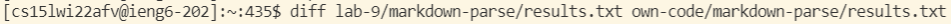
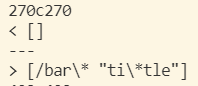
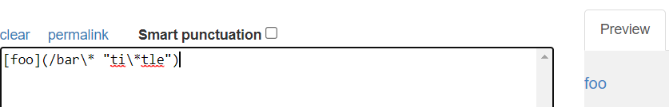
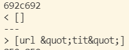
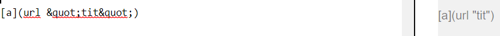

# Lab Report 5 Week 10

In order to see the tests that were returning different outputs between the two implementations of markdown-parse (i.e. the one given in lab 9 vs my own implementation), I used `diff` on the results of running `bash script.sh` since we had previosly "sent" the results to a `results.txt` file.

* Note: In the result for `diff`, `<` is the CS Lab 9 implementation, and `>` is my own implementation 

## Test 1
This tests corresponds to file `22.md` where *neither* implementation is correct, as seen below:

**Actual outputs:**

**Expected Output (according to [CommonMark demo site](https://spec.commonmark.org/dingus/))**

## Test 2
This implementation corresponds to file `41.md`, where the CS Lab 9 implementation is correct, as seen below:

**Actual outputs:**

**Expected Output (according to [CommonMark demo site](https://spec.commonmark.org/dingus/))**

